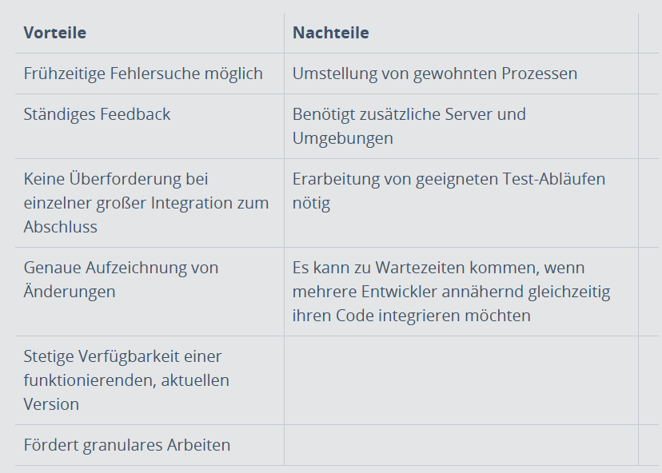
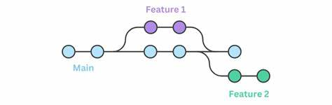
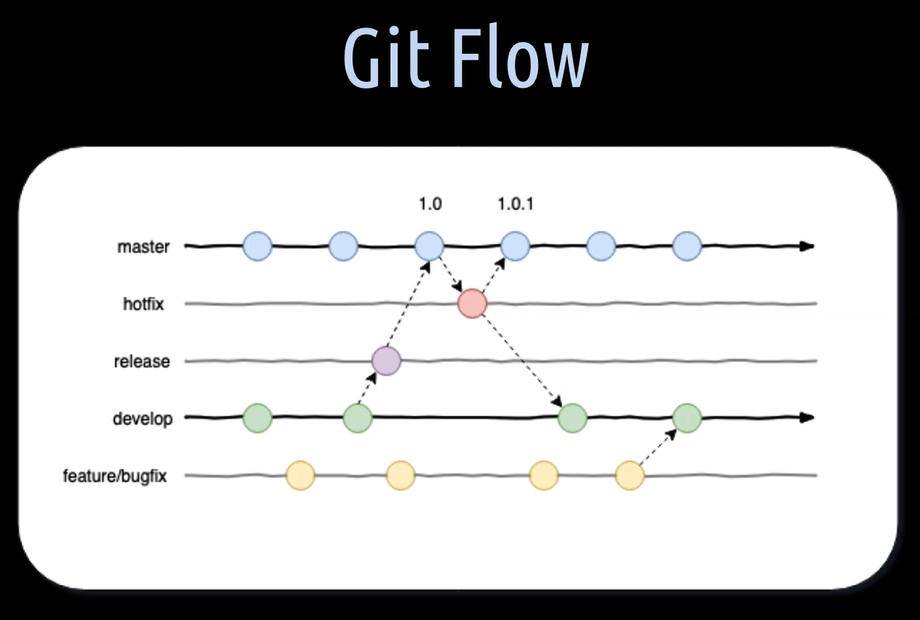
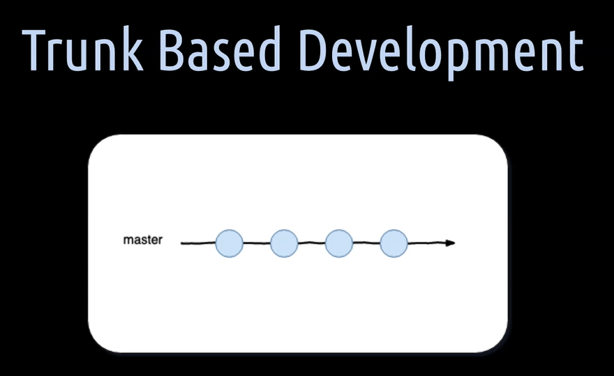

# Continuous Integration

CI und CD sind Begriffe, welche oft in der modernen Entwicklung und im Zusammenhang mit DevOps verwendet werden. CI steht für Continuos Integration, bei der Entwickler oft Codeänderungen ins zentrale Repository zusammenführen. In diesem zentralen Repository werden automatisierte Builds und Tests gelaufen. Mit CD kann entweder Coninutes Delivery oder Continuous Delivery gemeint sein. [0]


## Definition Continuous Integration
1. **Was ist Continuous Integration (CI) und wie wird es umgesetzt?**
   (Deutsch: Kontinuierliche Integration)

#### Hintergrund
   Bei herkömmlicher Entwicklung war jede Entwicklung für die manuelle Integration des neuen Codes in neue Iterationen einer App/Dienstes verantwortlich. Dies führte zu langsamen und fehleranfälligen Prozessen. Gründe dafür sind beispielsweise die Integration des Codes zu unterschiedlichen Zeitplänen. Die Integrierung des code letzte Moment erschwerte es den Teams herauszufinden, welche Änderung den Fehler verursacht hat. So wurde das Debuggen zu einem mühsamen Prozess.

#### Funktion
   Continuos Integration ist ein Softwareprozess, während der Entwickler ihren gesamten Entwicklungszyklus vom Code in die zentrale Repository integriert. Bei der Übermittlung verifizieren CI-Tools jede Integration. Dies geschieht durch die Entstellung einer Integration des Build und Durchführung automatisierter Tests. Dieser Prozess dient zur schnellen Identifizierung und Beschaffung der Integration. Dies geschieht durch die Fehlererkennung und Benachrichtigung vor der Zusammenführung des Codes des CI-Systems.

#### Motivation
   CI-Systeme motivieren Entwickler, ihre Codeänderungen mehrmals weiterzugeben durch kleine und gezielte Änderungen. Mithilfe von Tools wie Pull Requests und Merge Requests können Code-Reviews vor der Zusammenführung durchgeführt werden. [1]

## Vorteile & Nachteile
   
2. **Was sind die Vor- und Nachteile von CI**

(Quelle: https://www.ionos.de/digitalguide/websites/web-entwicklung/continuous-integration/ [a])


## Continuous Testing

3. **Was ist Continuous Testing und wie wird es umgesetzt?**
   
   ### Automatisierte Tests
   Server und Tools für CI, wie Jenkins, CircleCI, GitHub, AWS Code Pipeline und GitLabCI, überwachen die zentrale Repository. Wenn Änderungen erkannt werden, lösen Build-Server den Build-Prozess aus und führen vordefinierte Workload und Bull-Skripte durch. Sie kompilieren und verpacken den Code für das Testing und die Bereitstellung.

   Tests machen mindestens ein Drittel der CI-Aktivitäten aus. Der Code wird durch eine Reihe von Tests validiert, bevor er mit der Codebasis zusammengefügt wird:

   - **Unit-Tests** validieren einzelne Komponenten/Funktionen und erhalten sofortiges Feedback
   - **Integrationstests** prüfen die Interaktion zwischen Softwarekomponenten/Modulen und stellen sicher, dass Fehler aufgedeckt werden, wie möglicherweise von Unit-Tests übersehen wurden.
  
   Weitere Tests:
     - **End-to-End** Tests werden in einigen CI-Workflows verwendet für Softwarevalidierung. Dabei werden Anwenderinteraktionen simuliert.
     - Teams können **Codequalitätstests** und **statische Analyse** durchführen, um Stresstests durchzuführen oder Sicherheitslücken zu erkennen. [1]

## Branching Strategie

4. **Was ist eine Branching Strategie und welches sind die bekannten?**

   ### Zentrale Quellcode-Repositorys
   Das Zentrale Repository ist der Beginn von CI. Zentrale Repositorys dienen als Kernbestandteil von CI-Praktiken. Sie werden von Versionskontrollsystemen (VCS) wie Git und Bitbucket verwaltet. Die Änderungen von Entwicklern werden im zentralen Repository nachverfolgt durch die Historie der Änderungen. Für parallele Entwicklung werden Branching-Strategien wie Trunk-basierte Entwicklung oder Git Flow verwendet. Branching ermöglicht die isolierte Arbeit von anderen Entwicklern, bevor diese dann wieder in der Hauptbranche zusammengeführt werden.[1]

   ### Branch Typen
   - **Main-Branch** ist der Hauptzweig, in dem alle Entwicklungen integriert werden.
   - Im **Dev-Branch** werden Änderungen vor der Integration in den Feature-Branch gesammelt.
   - **Feature-Branches** dienen der Arbeit an neuen Funktionen.
   - **Release-Branches** können für Änderungen verwendet werden, die zur Veröffentlichung vorgesehen sind.
   - **Hotfix-Branches** dienen zur Behebung dringender Fehler im Dev-Branch.

   #### Feature Branching
   Für jede Änderung wird ein eigener Feature-Branch erstellt. Der Fokus liegt auf kurzen Entwicklungszyklen und dazu kontinuierlichem Feedback. Diese Strategie ist besonders gut für kleinere Teams geeignet.

   
   #### GitFlow
   GitFlow verwendet zwei Hauptzweige ('Master' und 'Development') und auchzusätzliche Branches für 'Features', 'Releases' und 'Hotfixes'. Die Entwicklung erfolgt im Feature-Branch. Von dem wird bei Bedarf ein Release-Branch abgezweigt. Nach Qualitätsprüfungen werden Änderungen in die Development verschoben und schlussendlich in den Main-Branch integriert. 
   - Vorteile sind klare Trennung. 
   - Nachteile sind komplexe Abläufe und hoher Verwaltungsaufwand.
  
   
   #### Trunk-Based Development
   Alle Entwickler integrieren ihre Änderungen täglich in den zentralen Trunk (main). Feature-Branches sind meist kurzlebig. Diese Strategie erfordert ein hohes Mass an Testautomatisierung.

   #### Weitere Modelle
   - **Forking Workflow**wird oft bei Open-Source-Projekte verwendet, bei denen Entwickler das Repository kopieren und Änderungen vor dem Merge vorschlagen.
   - **Release Branching** eignetsich güt für Projekte mit mehreren parallel laufenden Versionen. [2]

## User Stories
5.  **Wie kann man Commits und Branches mit User Stories verknüpfen?**
   Entwickler können Commits und Branches mit User Stories verknüpfen, indem sie die ID der User Story, etwa aus einem Tool wie Jira, in den Branch-Namen und die Commit-Nachrichten einfügen. Ein gängiger Ansatz ist es, den Branch-Namen als Kombination aus der User Story ID und einer kurzen Beschreibung (z. B. "ABC-123-feature-name") zu erstellen. Diese ID kann dann mit einem Git Hook automatisch an den Anfang jeder Commit-Nachricht gesetzt werden, indem ein Skript in der .git/hooks-Ordnerdatei prepare-commit-msg abgelegt wird. Durch diese Vorgehensweise wird eine direkte Rückverfolgbarkeit zwischen User Stories und Code-Änderungen gewährleistet, und die Verknüpfung mit Projektmanagement-Tools wie BitBucket oder Jira wird erleichtert. [3]


## Merge Strategien
6. **Welche Merge Strategien gibt es und wie werden sie umgesetzt?**
   - Ort (Standardstrategie): Diese Strategie verwendet einen 3-Wege-Merge-Algorithmus, um Konflikte zu lösen, und berücksichtigt dabei gemeinsame Vorfahren. Sie kann auch Umbenennungen erkennen und behandeln. Sie bevorzugt unsere Version oder ihre Version bei Konflikten mit zusätzlichen Optionen wie ours und theirs.

   - Recursive (ehemalige Standardstrategie): Auch eine 3-Wege-Merge-Strategie, die ebenfalls mit mehreren gemeinsamen Vorfahren arbeitet und Umbenennungen erkennt. Sie nimmt spezielle Optionen wie diff-algorithm und no-renames.

   - Resolve: Diese Strategie arbeitet mit zwei Branches und verwendet einen 3-Wege-Merge-Algorithmus, erkennt jedoch keine Umbenennungen.

   - Octopus: Für das Zusammenführen von mehr als zwei Branches. Diese Strategie löst einfache Konflikte, erfordert aber bei komplexen Konflikten manuelle Eingriffe.

   - Ours: Bei dieser Strategie wird die aktuelle Branch-Version beibehalten, und Änderungen von allen anderen Branches werden ignoriert. Dies eignet sich, um alte Entwicklungen von Neben-Branches zu überschreiben.

   - Subtree: Diese Strategie passt den Baum von Branch B an den von Branch A an, wenn B ein Unterbaum von A ist. [4]
  
## Semamtic Versioning
7. **Was ist Semantic Versioning und wie wird es umgesetzt?**
   - ### **Was ist Semantic Versioning?**

Semantic Versioning wird verwendet, um Änderungen in einer Software zu kommunizieren. Es wird durch das Schema **MAJOR.MINOR.PATCH** beschrieben:
- **MAJOR**: Wird erhöht, wenn inkompatible Änderungen eingeführt werden (auch Breaking Changes genannt).
- **MINOR**: Wird erhöht, wenn neue Funktionen hinzugefügt werden, die abwärtskompatibel sind.
- **PATCH**: Wird erhöht, wenn Fehlerbehebungen oder kleinere Änderungen erfolgen, die keine neuen Funktionen oder Breaking Changes einführen.

**Beispiel:**
- Version 1.2.3:
  - **1**: Major (Breaking Changes)
  - **2**: Minor (neue Features, kompatibel)
  - **3**: Patch (Fehlerbehebungen)

**Zusätzliche Bezeichnungen:**
- **Pre-Release-Tags**: `1.0.0-alpha`, `1.0.0-beta` (für experimentelle Versionen).
- **Build-Metadaten**: `1.0.0+20231126` (für spezifische Builds).

### **Umsetzung von Semantic Versioning**

#### **1. Manuelle Umsetzung**
**GIT Tags**: Mit Git können Versionen markiert werden.
- **Tag setzen**:
  ```bash
  git tag -a v2.0.0 -m "Release v2.0.0"
  git push origin v2.0.0
  ```
- **Changelog aktualisieren**: Notiere Änderungen in einer Datei wie `CHANGELOG.md`.

#### **2. Automatische Umsetzung**
Mit Tools wie **Semantic Release** können Versionen automatisch generiert werden.

1. **Installiere Semantic Release**:
   ```bash
   npm install --save-dev semantic-release
   ```

2. **Konfigurationsdatei hinzufügen** (`.releaserc`):
   ```json
   {
     "branches": ["main"],
     "plugins": [
       "@semantic-release/commit-analyzer",
       "@semantic-release/release-notes-generator",
       "@semantic-release/changelog",
       "@semantic-release/git"
     ]
   }
   ```

3. **Pipeline erstellen (z. B. GitLab CI/CD)**:
   ```yaml
   stages:
     - release

   semantic_release:
     image: node:latest
     stage: release
     script:
       - npm ci
       - npx semantic-release
   ```

4. **Commit-Messages standardisieren**:
   Verwende **Conventional Commits** für verständliche und maschinenlesbare Nachrichten:
   - `fix:` für Fehlerbehebungen.
   - `feat:` für neue Features.
   - `docs:` für Dokumentationsänderungen. [5]

## Mono- vs. Multirepo
8. **Welchen Unterschied haben Mono- und Multirepo (speziell im Zusammenhang mit Microservices)?**
Hier ist eine übersichtliche Tabelle, die die Unterschiede zwischen **Monorepo** und **Multi-Repo** im Zusammenhang mit Microservices darstellt:

| **Kriterium**                  | **Monorepo**                                                                 | **Multi-Repo**                                                              |
|--------------------------------|------------------------------------------------------------------------------|-----------------------------------------------------------------------------|
| **Versionskontrolle**          | Alle Microservices in einem einzigen Repository, zentrale Versionierung.    | Jeder Microservice hat ein eigenes Repository, unabhängige Versionierung.  |
| **Deployment**                 | Gemeinsame Release-Pipeline, Änderungen sind synchronisiert.                | Jeder Service kann unabhängig bereitgestellt werden.                       |
| **Abhängigkeiten**             | Gemeinsame Abhängigkeiten werden zentral verwaltet.                         | Abhängigkeiten müssen manuell zwischen Repos synchronisiert werden.        |
| **Tests**                      | Tests für alle Services können bei Änderungen automatisch ausgeführt werden. | Jeder Service ist für seine eigenen Tests verantwortlich.                  |
| **Refactorings**               | Anwendungsweite Refactorings einfach durchzuführen.                         | Refactorings erfordern Änderungen in mehreren Repos.                       |
| **Teamarbeit**                 | Fördert Zusammenarbeit, alle Änderungen sind sofort sichtbar.               | Teams arbeiten autark, potenzielle Isolation der Teams.                    |
| **Autonomie**                  | Teams haben weniger Autonomie, da alle an einem Repository arbeiten.        | Teams können unabhängig arbeiten und eigene Tools verwenden.               |
| **Skalierbarkeit**             | Kann bei großen Codebasen langsam werden (z. B. Git-Operationen).           | Kleinere Repositories sind schneller und einfacher zu verwalten.           |
| **Performance**                | Erfordert das Klonen der gesamten Codebasis, auch wenn nur ein Service benötigt wird. | Nur das benötigte Repository muss geklont werden.                          |
| **Kultur**                     | Fördert Einheitlichkeit in Tools und Praktiken zwischen Teams.              | Teams können ihre eigenen Methoden und Tools nutzen.                       |
| **Geeignet für**               | Projekte mit starken Abhängigkeiten zwischen Services.                      | Projekte mit weitgehend unabhängigen Services.                             |
[6]

## Artifact-Repository 
9.  **Was ist eine Artifact-Repository und welche Rolle spielt es in Ihrem Prozess?**
### **Was ist ein Artifact-Repository?**
Ein **Artifact-Repository** ist eine zentrale Plattform zur Verwaltung von Software-Artefakten (z. B. ausführbare Dateien, Bibliotheken, Container-Images), die im Entwicklungsprozess erstellt, genutzt oder verteilt werden. Es sorgt für Konsistenz, Nachvollziehbarkeit und Effizienz in **CI/CD-Workflows**.

### **Rolle im Entwicklungsprozess**
1. **Zentrale Speicherung**: Alle Artefakte werden an einem Ort gespeichert und versioniert, was Zugriff und Nachverfolgbarkeit erleichtert.
2. **Nachvollziehbare Builds**: Metadaten wie Versionen und Zeitstempel ermöglichen reproduzierbare Builds.
3. **Effizienz in CI/CD**: Build-Artefakte müssen nicht wiederholt erstellt werden, da sie aus dem Repository abgerufen werden können.
4. **Verteilung**: Artefakte können konsistent in Test- und Produktionsumgebungen bereitgestellt werden.
5. **Flexibilität**: Unterstützt verschiedene Technologien und Paketformate (z. B. Maven, Docker, npm).
[7]


## Quellen:

### Textquellen:
[0] Atlassian. (o. J.). Continuous integration vs. delivery vs. deployment.  
https://www.atlassian.com/continuous-delivery/principles/continuous-integration-vs-delivery-vs-deployment  
(Abrufdatum: 19.11.2024)

[1] IBM. (o. J.). Continuous Integration.  
https://www.ibm.com/de-de/topics/continuous-integration  
(Abrufdatum: 19.11.2024)

[2] Katla, V. (o. J.). CI/CD Branches Strategies.  
https://medium.com/@katla.vamshi/ci-cd-branches-strategies-449befdeb1b5  
(Abrufdatum: 19.11.2024)

[3] HubSpot. (o. J.). Continuous Integration.  
https://blog.hubspot.de/website/continuous-integration  
(Abrufdatum: 19.11.2024)

[4] Lee, N. (o. J.). Prepending Your Git Commit Messages with User Story IDs.  
https://medium.com/@nicklee1/prepending-your-git-commit-messages-with-user-story-ids-3bfea00eab5a  
(Abrufdatum: 19.11.2024)

[5] Opensight. (o. J.). Git Semantic Versioning and Conventional Commits.  
https://medium.com/opensight-ch/git-semantic-versioning-and-conventional-commits-564aece418a0  
(Abrufdatum: 19.11.2024)

[6] Kinsta. (o. J.). Monorepo vs. Multi-Repo.  
https://kinsta.com/de/blog/monorepo-vs-multi-repo/  
(Abrufdatum: 19.11.2024)

[7] JFrog. (o. J.). Was ist ein Artefakt-Repository?  
https://jfrog.com/de/devops-tools/article/what-is-an-artifact-repository/  
(Abrufdatum: 19.11.2024)

---

### Bildquellen:
[a] Ionos. (o. J.). Continuous Integration: Definition und Ablauf.  
https://www.ionos.de/digitalguide/websites/web-entwicklung/continuous-integration/  
(Abrufdatum: 19.11.2024)

[b] Applitools. (o. J.). Test Automation University, Kapitel 6.  
https://testautomationu.applitools.com/course47/chapter6-img1.png  
(Abrufdatum: 19.11.2024)

[c] Applitools. (o. J.). Test Automation University, Kapitel 6.  
https://testautomationu.applitools.com/course47/chapter6-img3.png  
(Abrufdatum: 19.11.2024)

[d] Bing Images. (o. J.). Suchergebnis: Continuous Integration.  
https://th.bing.com/th/id/OIP.ei8Um9_L8KsoQBJ6D0TD7wHaCW?rs=1&pid=ImgDetMain  
(Abrufdatum: 19.11.2024)