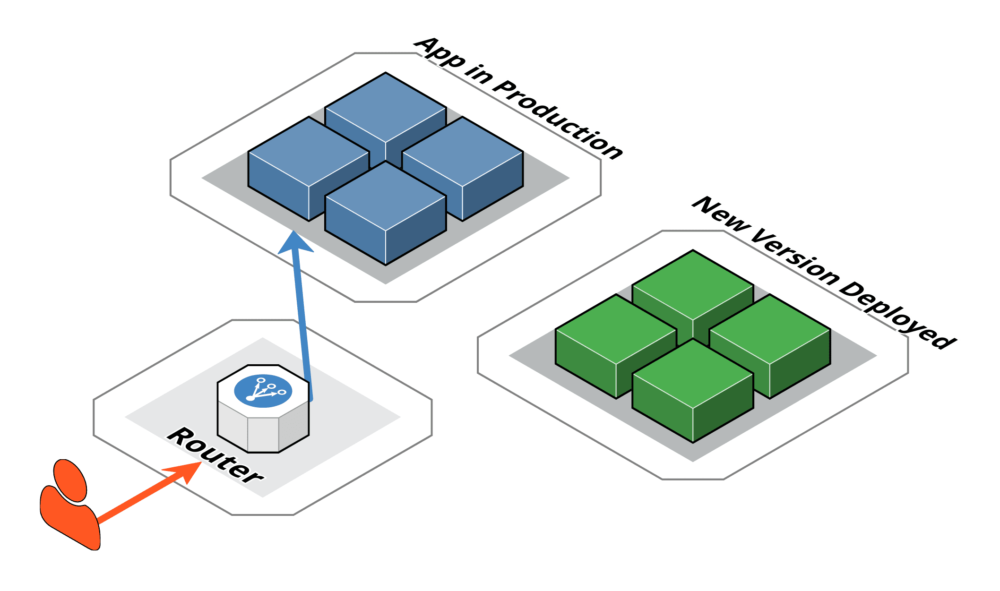
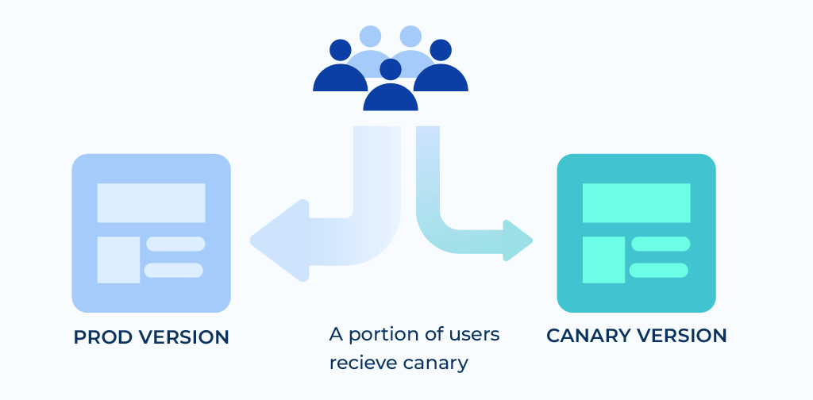

### Continuous Deployment

**1. Was ist Continuous Deployment und wie wird es umgesetzt?**

Continuous Deployment (CD) ist eine Methode in der Softwareentwicklung, bei der Änderungen am Code automatisch nach dem erfolgreichen Bestehen von Tests in die Produktionsumgebung ausgerollt werden. Der Hauptzweck besteht darin, Softwareänderungen schnell, zuverlässig und kontinuierlich für Endbenutzer verfügbar zu machen.

*Umsetzung von Continuous Deployment:*

**Automatisierte Tests:**  Sicherstellen, dass alle Codeänderungen durch umfassende automatisierte Tests validiert werden, um die Qualität und Stabilität des Codes zu gewährleisten.

**CI/CD-Pipeline:** Implementierung einer Continuous Integration/Continuous Deployment-Pipeline, die den gesamten Prozess von der Code-Integration bis zur Bereitstellung automatisiert.

**Monitoring:** Etablierung von Überwachungsmechanismen, um die Leistung und Zuverlässigkeit der Anwendung nach dem Deployment zu überprüfen.

In unserem Projekt versionieren wir unseren Code auf Github, schreiben Unit Tests, setzen unsere Deployment Umgebung auf mit Docker und benutzen Github Actions für die Automatisierung. 

Quelle: https://mindsquare.de/knowhow/continuous-deployment

**2. Was ist der Unterschied zwischen Continuous Deployment und Continuous Delivery?**

- **Continuous Delivery:** Hierbei werden Codeänderungen automatisch gebaut, getestet und in eine Staging-Umgebung bereitgestellt. Die Entscheidung, wann diese Änderungen in die Produktionsumgebung überführt werden, erfolgt manuell. Dies ermöglicht zusätzliche Überprüfungen oder manuelle Freigaben vor dem Live-Gang. 

- **Continuous Deployment:** In diesem Ansatz werden Codeänderungen nach erfolgreichen automatisierten Tests ohne manuelle Eingriffe direkt in die Produktionsumgebung ausgerollt. Dies erfordert ein hohes Maß an Automatisierung und Vertrauen in die Qualität der Tests. 

Quelle: https://www.jetbrains.com/de-de/teamcity/ci-cd-guide/continuous-integration-vs-delivery-vs-deployment

**3. Was sind die Vor- und Nachteile von Continuous Delivery und Continuous Deployment?**

**Continuous Delivery**

*Vorteile*

- Flexibilität: Änderungen werden in einer Staging-Umgebung bereitgestellt, und das Team hat die Kontrolle über den Zeitpunkt des Produktionsreleases. 

- Risikominimierung: Manuelle Freigaben ermöglichen zusätzliche Überprüfungen, um Fehler in der Produktionsumgebung zu vermeiden.

*Nachteile*

- Verlangsamter Prozess: Das manuelle Freigabesystem kann zu Verzögerungen führen. 
- Zusätzliche Ressourcen: Erfordert dedizierte Ressourcen für Freigabe- und Staging-Management. 

**Continuous Deployment**

*Vorteile*

- Schnelligkeit: Jede Änderung wird automatisch und unmittelbar nach Bestehen der Tests in die Produktionsumgebung gebracht. 
- Automatisierung: Reduziert den manuellen Aufwand und beschleunigt die Iterationen. 

*Nachteile*

- Höheres Risiko: Fehler können schneller in die Produktionsumgebung gelangen, wenn die Tests nicht umfassend genug sind.
- Abhängigkeit von Tests: Die Qualität der Automatisierungstests bestimmt direkt die Stabilität der Produktion. 

Quelle: https://www.jetbrains.com/de-de/teamcity/ci-cd-guide/continuous-integration-vs-delivery-vs-deployment

**4. Was sind die folgenden Deployment Strategien und wie werden sie umgesetzt?**

*Blue/Green Deployment*
  
Es werden zwei identische Produktionsumgebungen betrieben – "Blue" (aktuell live) und "Green" (neue Version). Die neue Version wird in der Green-Umgebung bereitgestellt und getestet. Nach erfolgreichem Test wird der Datenverkehr auf die Green-Umgebung umgeschaltet, wodurch die Green-Umgebung zur neuen Live-Umgebung wird. Dies ermöglicht ein schnelles Rollback, indem der Traffic zurück auf die Blue-Umgebung geleitet wird. 

Bildquelle: https://candost.blog/images/content/posts/blue-green-deployment/BlueGreenDeployment5.png

*Canary Deployment*

Canary Deployment: Neue Softwareversionen werden schrittweise an eine kleine Benutzergruppe ausgerollt. Wenn keine Probleme auftreten, wird die Verteilung schrittweise auf die gesamte Benutzerbasis ausgeweitet. Dies minimiert das Risiko, da potenzielle Fehler nur einen kleinen Teil der Nutzer betreffen. 

Bildquelle: https://cdn.prod.website-files.com/5c9200c49b1194323aff7304/66b5cb5eb11a27792da63da7_63074d50cbaa553b731d81d6_Canary_Diagram-2.png

Quelle: https://harness.io/blog/blue-green-canary-deployment-strategies

**5. Was ist A/B Testing?**

A/B-Testing, auch bekannt als Split-Testing, ist eine Methode, bei der zwei Versionen einer Anwendung oder Funktion miteinander verglichen werden, um festzustellen, welche besser performt oder von den Nutzern bevorzugt wird. Dies wird erreicht, indem verschiedene Benutzergruppen unterschiedlichen Versionen ausgesetzt werden und deren Interaktionen analysiert werden.

Quelle: https://en.wikipedia.org/wiki/A/B_testing

**6. Was sind Feature Toggles?**

Feature Toggles sind Techniken, bei denen bestimmte Funktionen im Code durch Konfigurationsschalter aktiviert oder deaktiviert werden können. Dies ermöglicht es, unfertige Features im Code zu behalten, ohne sie den Endnutzern zugänglich zu machen, und erleichtert das Testen und schrittweise Ausrollen von Funktionen.

Quelle: https://en.wikipedia.org/wiki/Feature_toggle

**7. Was sind Rollback Strategien?**

Rollback-Strategien sind Methoden, um bei Problemen nach einem Deployment schnell auf eine vorherige stabile Version zurückzukehren. Dies kann durch Techniken wie Blue/Green Deployment oder durch das Bereithalten von Backups erreicht werden.

Quelle: https://appmaster.io/de/glossary/rollback-strategie-fur-die-bereitstellung

**8. Was ist Continous Monitoring?**

Continuous Monitoring (kontinuierliche Überwachung) ist ein Ansatz, bei dem Organisationen ihre IT-Systeme und Netzwerke fortlaufend überwachen, um Sicherheitsbedrohungen, Leistungsprobleme oder Compliance-Verstösse in Echtzeit zu erkennen. Ziel ist es, potenzielle Probleme frühzeitig zu identifizieren und schnell darauf reagieren zu können. 

Quelle: https://www.crowdstrike.com/de-de/cybersecurity-101/next-gen-siem/continuous-monitoring

*Umsetzung von Continuous Monitoring*

Definition von Überwachungszielen: Festlegung, welche Systeme, Anwendungen und Prozesse überwacht werden sollen, basierend auf organisatorischen Anforderungen und Risiken.

Einsatz automatisierter Tools: Implementierung von Softwarelösungen, die kontinuierlich Daten sammeln und analysieren, um Anomalien oder Verstöße zu erkennen. 

Quelle: https://www.atatus.com/glossary/continuous-monitoring

Echtzeit-Analyse: Verwendung von Technologien, die Daten in Echtzeit auswerten, um sofortige Einblicke in den Zustand der IT-Infrastruktur zu erhalten. 

Quelle: https://www.splunk.com/en_us/blog/learn/continuous-monitoring.html

**9. Wie werden Passwörter sicher gespeichert?**

Um Passwörter sicher zu speichern, empfiehlt es sich, einen vertrauenswürdigen Passwort-Manager zu verwenden. Diese Programme verschlüsseln Ihre Zugangsdaten und ermöglichen es, für jedes Konto ein individuelles, starkes Passwort zu erstellen. Sie müssen sich dann nur noch ein Master-Passwort merken, das den Zugriff auf den Passwort-Manager schützt. 

Es ist ratsam, Passwörter nicht im Browser zu speichern, da diese von Schadsoftware leichter ausgelesen werden können. Stattdessen bieten eigenständige Passwort-Manager einen höheren Sicherheitsstandard. 

Zusätzlich zur Verwendung eines Passwort-Managers sollte für wichtige Konten die Zwei-Faktor-Authentifizierung aktiviert werden. Dieses Verfahren erhöht die Sicherheit, indem es neben dem Passwort einen weiteren Bestätigungsfaktor erfordert, wie beispielsweise einen Code, der an ein mobiles Gerät gesendet wird. 

Bildquelle: https://cdn.prod.website-files.com/65f7f0027cb1900111ab2e6f/66dacaddaef590ecba2db584_DS_Blog_Admin-Passwoerter-sicher-speichern.webp

Quelle: https://www.bsi.bund.de/DE/Themen/Verbraucherinnen-und-Verbraucher/Informationen-und-Empfehlungen/Cyber-Sicherheitsempfehlungen/Accountschutz/Sichere-Passwoerter-erstellen/Passwort-Manager/passwort-manager_node.html

**10. Welche Arten von Deployment gibt es? Geben Sie alle Ihre Ideen an. Sie müssen dann nicht alle umsetzen, aber finden Sie heraus was alles möglich ist (z.B. Container via Docker, Container via Docker swarm, Direkt auf Server code kompilieren, etc). geben Sie dabei jeweils auch an, welche Software/Umgebung dazu notwendig ist.**

1. **Containerisierung mit Docker**:
   - Docker ermöglicht die Erstellung und Verwaltung von Containern, die Anwendungen und ihre Abhängigkeiten isoliert ausführen. 

   Quelle: https://www.studysmarter.de/ausbildung/ausbildung-in-it/fachberater-softwaretechniken/deployment/

2. **Container-Orchestrierung mit Docker Swarm**:
   - Docker Swarm dient zur Verwaltung und Skalierung von Docker-Containern über mehrere Hosts hinweg. 

   Quelle: https://docs.docker.com/guides/orchestration/

3. **Container-Orchestrierung mit Kubernetes**:
   - Kubernetes ist ein Open-Source-System zur Automatisierung der Bereitstellung, Skalierung und Verwaltung von containerisierten Anwendungen. 

   Quelle: https://kubernetes.io/docs/concepts/workloads/controllers/deployment/

4. **Direkte Bereitstellung auf Servern (Bare-Metal Deployment)**:
   - Bei dieser Methode wird der Code direkt auf physischen oder virtuellen Servern kompiliert und ausgeführt. 

   Quelle: https://www.techtarget.com/searchitoperations/definition/bare-metal-provisioning

5. **Virtuelle Maschinen (VMs)**:
   - Anwendungen werden innerhalb von VMs bereitgestellt, die auf Hypervisoren wie VMware, Hyper-V oder KVM laufen. 

   Quelle: https://docs.vmware.com/en/VMware-vSphere/7.0/com.vmware.vsphere.vm_admin.doc/GUID-39D19B2B-A11C-42AE-AC80-DDA8682AB42C.html

6. **Platform as a Service (PaaS)**:
   - PaaS-Anbieter wie Heroku, Google App Engine oder Microsoft Azure stellen Infrastruktur und Laufzeitumgebungen für Anwendungen bereit. 

Quelle: https://azure.microsoft.com/en-us/resources/cloud-computing-dictionary/what-is-paas

7. **Serverless Deployment**:
    - Anwendungen werden als Funktionen bereitgestellt, die von Cloud-Anbietern verwaltet werden, ohne dass Serverprovisionierung erforderlich ist. Ein Beispiel wäre AWS Lamda.

    Quelle: https://www.serverless.com/framework/docs/providers/aws/cli-reference/deploy

